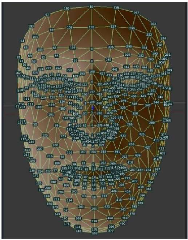
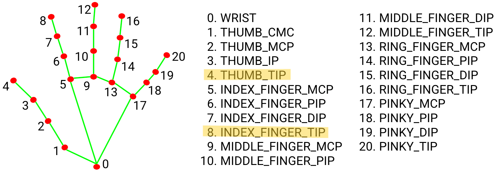

# FocusFlow
- Attention-aware media controller 


**FocusFlow** is a tool that allows you to control media playback on your computer using only **Head Movements** and **Hand Gestures**. No mouse, no keyboard just focus.

---

## 📋 Executive Summary
In the era of multitasking, physical interaction with devices (mouse/keyboard) creates friction. **FocusFlow** removes this friction by turning your webcam into an intelligent sensor. It tracks your attention state to automatically pause videos when you look away and allows you to adjust volume by simply pinching the air. It seamlessly integrates Computer Vision (CV) with system automation to create a "magic-like" user experience.

---

## ❓ Problem Statement & Solution

### The Problem
* **Disruption:** Pausing a video to talk to someone or take notes breaks immersion.
* **Accessibility:** Adjusting volume while eating or cooking is difficult.
* **Efficiency:** Students watching lectures often miss content when they look down to write notes.

### The Solution
**FocusFlow** runs in the background and provides:
1.  **Auto-Pause/Play:** Uses Head Pose Estimation to detect if the user is looking at the screen.
    * *Look Away* → Video Pauses ⏸️
    * *Look Back* → Video Resumes ▶️
2.  **Gesture Volume Control:** Uses Hand Tracking to detect finger distance.
    * *Pinch* → Volume Down 🔉
    * *Spread* → Volume Up 🔊

---

## 🎥 Project Demo

Check out FocusFlow in action:

<div align="center">
  <video src="demo/demo_video.mp4" width="600" />
</div>

> *Note: If the video doesn't load, please navigate to the `demo/` folder in this repository.*

---

## 🛠️ Technologies Used
* **Python:** Core logic and scripting.
* **OpenCV (`cv2`):** Image processing and PnP (Perspective-n-Point) algorithms.
* **MediaPipe:** Pre-trained ML models for Face Mesh (468 landmarks) and Hand Tracking (21 landmarks).
* **PyAutoGUI:** Simulates system-level keyboard presses (`Space`, `PlayPause`, `VolumeUp`, `VolumeDown`) for universal compatibility with YouTube, VLC, Netflix, etc.
* **NumPy:** Efficient mathematical operations for vector algebra.

---

## 🌟 Features & Mathematical Intuition

### 1. The Head Pose Tracking
**Goal:** Determine if the user is looking at the screen.

**How it works:**
Uses the **Perspective-n-Point (PnP)** algorithm. This finds the 3D orientation of the head by matching 2D points on the image (what the camera sees) to a standard 3D face model.

**The Math:**
1.  **Landmarks:** Extract 6 key points- Nose tip, Chin, Left/Right Eyes, Left/Right Mouth corners.
2.  **Rotation Vector:** `cv2.solvePnP` calculates the Rotation Matrix needed to align the 3D model with the 2D pixels.
3.  **Euler Angles:** Decompose the matrix into Pitch (Up/Down), Yaw (Left/Right), and Roll (Tilt).
    * If **Yaw > 15°** (Looking Right) OR **Yaw < -15°** (Looking Left) → **PAUSE**.

<div align="center">
  
  <p><i>Figure 1: 3D Face Mesh Landmarks used for PnP calculation</i></p>
</div>

-> 33: Left eye, corner (inner/outer depending on camera orientation).
-> 263: Right eye, corner (inner/outer depending on camera orientation).
-> 1: Nose tip (central point).
-> 61: Left mouth corner.
-> 291: Right mouth corner.
-> 199: Lower lip/chin area. 

### 2. The Volume Control
**Goal:** Adjust volume based on finger pinch distance.

**How it works:**
It tracks the **Thumb Tip (ID 4)** and **Index Finger Tip (ID 8)**. Then calculate the Euclidean Distance between them to create interaction zones.

**The Math:**
$$d = \sqrt{(x_2 - x_1)^2 + (y_2 - y_1)^2}$$

* **Zone 1 (Pinch):** If $d < 50$ pixels → Trigger `VolumeDown`.
* **Zone 2 (Spread):** If $d > 180$ pixels → Trigger `VolumeUp`.
* **Zone 3 (Stable):** If $50 < d < 180$ → No Action (Prevents accidental changes).

<div align="center">
  
  <p><i>Figure 2: Hand Landmarks</i></p>
</div>

---

## 📂 Project Structure

```bash
FocusFlow/
│
├── assets/                 # Images for README (diagrams, screenshots)
│   ├── head_pose_landmarks.png
│   └── hand_landmarks.png
│
├── demo/                   # Demo video folder
│   └── demo_video.mp4
│
├── env/                    # Virtual Environment (not uploaded to git)
│
├── focus_flow.py           # MAIN SCRIPT (Run this file)
├── README.md               # Documentation
└── requirements.txt        # Dependencies
